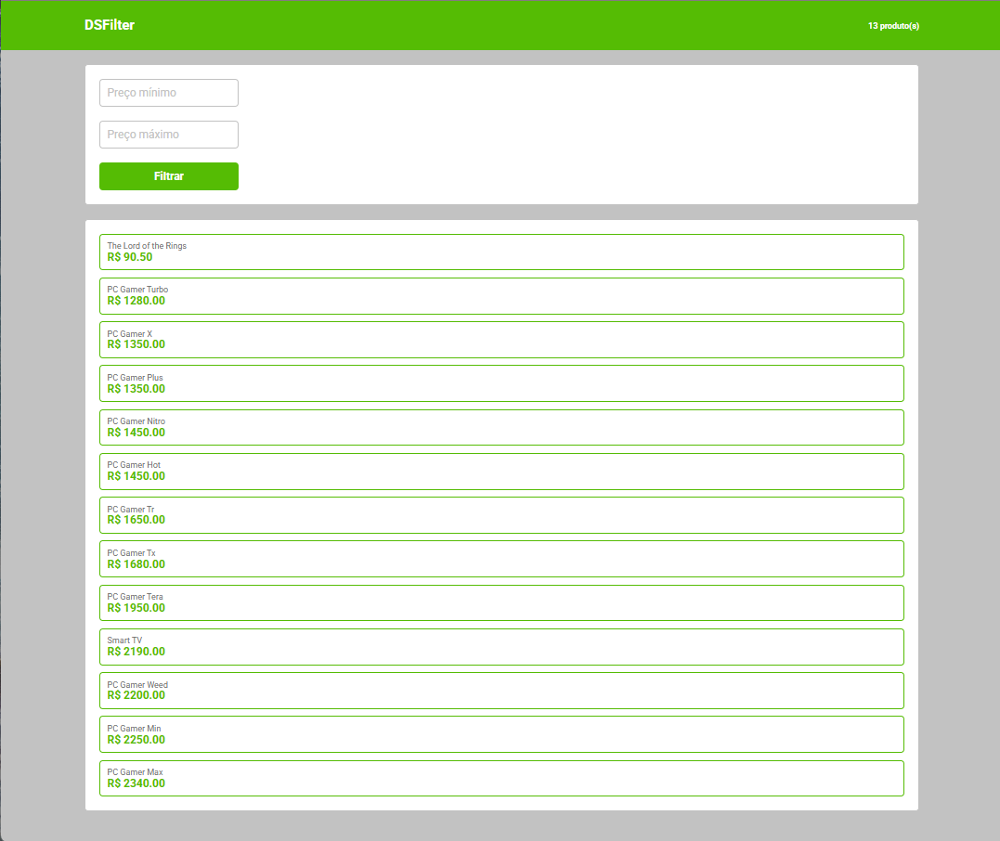
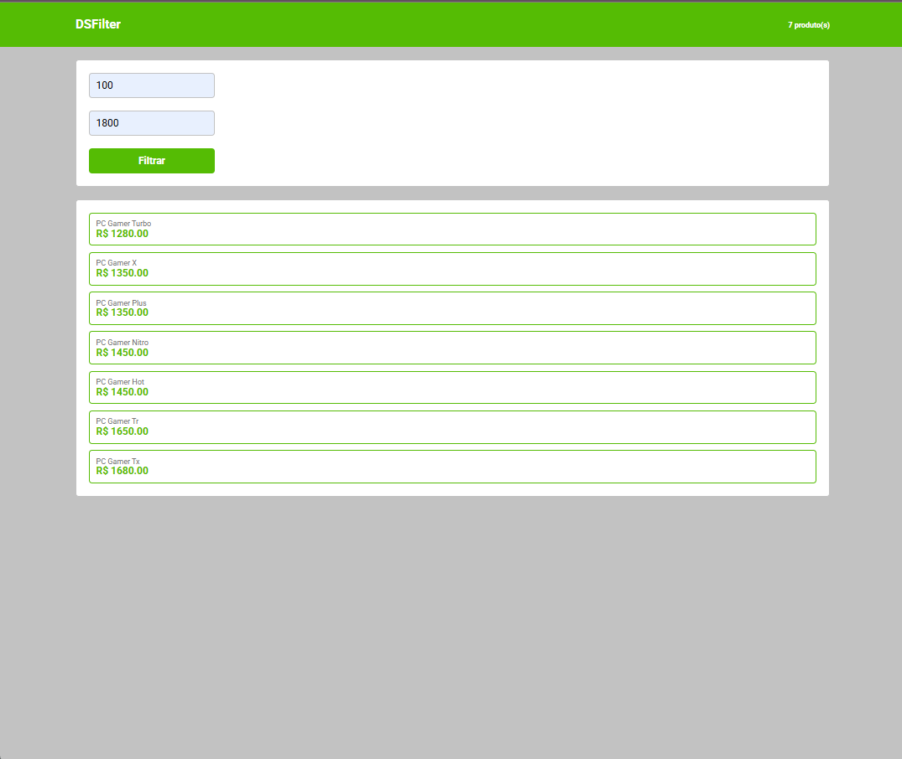

# <center>🛒 DSFilter </center>

<p align='center'>
   
   
   
   
</p>

Este projeto implementa o desafio **DSFilter** da Formação ReactJS Professional proposto pela [DevSuperior](https://devsuperior.com.br/), que consiste em desenvolver uma tela de listagem e filtragem de produtos utilizando o React, TypeScript e a Context API para gerenciamento de estado global.

O objetivo principal é criar um sistema que permite ao usuário filtrar produtos por preço mínimo e máximo, com o total de produtos listados sendo exibido em tempo real no cabeçalho da aplicação.

---

## 💻 Habilidades Técnicas e Tecnologias

Este projeto demonstra as seguintes habilidades e tecnologias essenciais do ecossistema front-end moderno:

* Construção de uma Single Page Application (SPA) modular e componentizada com ReactJS.
* Utilização de tipagem estática para maior segurança e robustez do código (ex: `ProductDTO`, tipos de contexto e props).
* **Gerenciamento de Estado Local (`useState`):** Gerenciamento do estado da lista de produtos e dos parâmetros de filtro (`minPrice`, `maxPrice`) dentro do componente `ListingBody`.
* **Gerenciamento de Efeitos Colaterais (`useEffect`):** Utilização de `useEffect` para reagir a mudanças nos parâmetros de filtro e realizar a busca de produtos (`findByPrice`).
* **Context API:** Implementação de um estado global para o **número de produtos listados** (`ProductCounterContext`). Isso permite que o `Header` observe e reaja às mudanças na listagem feitas no `ListingBody`.
* **Comunicação entre Componentes:**
    * **Comunicação Pai-Filho:** Passagem da lista de produtos como `Prop` para o card de listagem (`Listing`).
    * **Comunicação Filho-Pai (Eventos):** O componente `Filter` emite um evento `onFilter(min, max)` para notificar o componente pai (`ListingBody`) sobre os novos critérios de filtragem.
* **Renderização Condicional:** Exibição da lista de produtos ou da mensagem "Nenhum produto encontrado" baseada no estado da lista.

---

## ✨ Funcionalidades

* **Listagem de Produtos:** O sistema informa nome e preço de todos produtos, ordenados por preço.
* **Filtragem Dinâmica:** Permite informar, opcionalmente, preço mínimo e preço máximo, resultando na exibição dos produtos conforme os critérios.
    * Valores Padrão: Se o preço mínimo não for informado, usa `0`. Se o preço máximo não for informado, usa `Number.MAX_VALUE`.
* **Atualização do Cabeçalho:** O número de produtos listados é atualizado dinamicamente no cabeçalho (componente `Header`) a cada nova filtragem.

---
## 📸 Screenshots da Aplicação

### 



###



---

## 🚀 Como Executar o Projeto

1.  **Clone o repositório:**
    ```bash
    git clone git@github.com:iolymmoliveira/desafios_reactJS.git
    cd desafio_filter
    ```

2.  **Instale as dependências:**
    ```bash
    yarn
    ```

3.  **Inicie o servidor de desenvolvimento:**
    ```bash
    yarn dev
    ```
4.  **Abra o projeto no navegador:**
O projeto será iniciado em `http://localhost:5173`.

---
