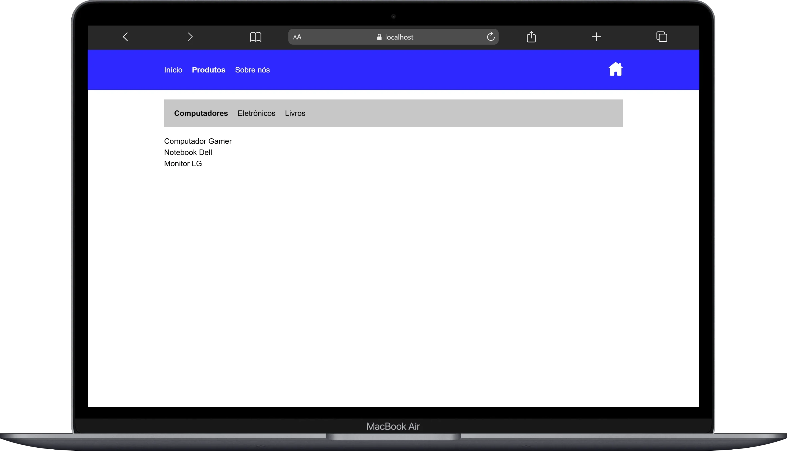
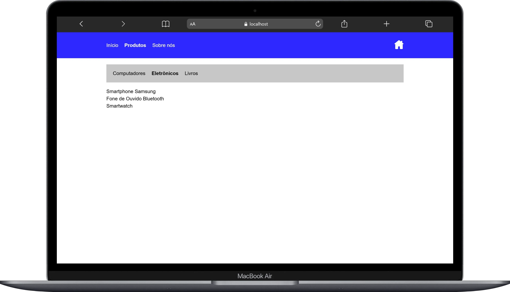

# 🛣️ React Routing Challenge

Aplicação desenvolvida para praticar navegação entre páginas e estruturação de rotas em aplicações SPA.

## 🚀 Objetivo

Implementar múltiplas páginas e navegação client-side, simulando a estrutura de aplicações reais.

## 🧠 Conceitos Aplicados

- React Router
- Navegação entre rotas
- Rotas aninhadas
- Parâmetros de rota
- Layouts compartilhados

## 🛠️ Stack

- React  
- TypeScript  
- React Router  

## ▶️ Executar

```
yarn
yarn dev
```

## 📸 Preview da Aplicação
<div align="center">
  
   |
</div>
